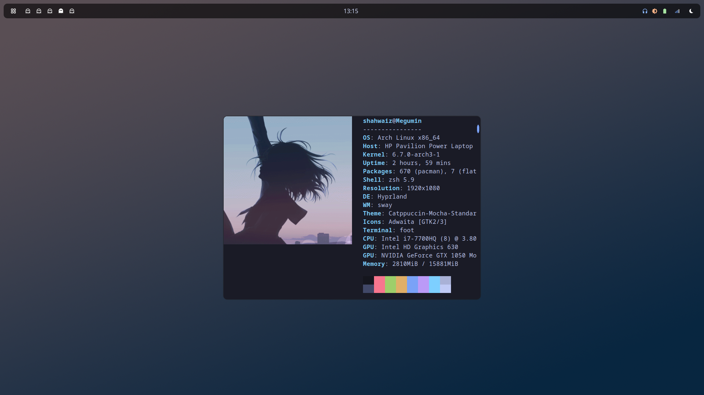

  

#### [System Information]
Operating system: [Arch Linux](https://archlinux.org/)  
Window manager: [Hyprland](https://github.com/hyprwm/Hyprland)  
Launcher: [Rofi](https://github.com/davatorium/rofi)  
System bar: [Waybar](https://github.com/Alexays/Waybar)  
Terminal: [foot](https://codeberg.org/dnkl/foot)  
GTK3 settings: [nwg-look](https://github.com/nwg-piotr/nwg-look)  
Rofi modules: [adi1090x/rofi](https://github.com/adi1090x/rofi)  
Screenshots: [grim](https://sr.ht/~emersion/grim/)  
Notifications: [dunst](https://github.com/dunst-project/dunst)  
Wallpapers: [swaybg](https://github.com/swaywm/swaybg)  

#### [Custom script for setting wallpaper in Thunar]  
`echo %f > /home/shahwaiz/wallpaper && swaybg -i %f -m fill`  

#### [MISC]  
most stuff was ported over from my fedora [rice](https://github.com/shahwaizse/fedora-dots)
